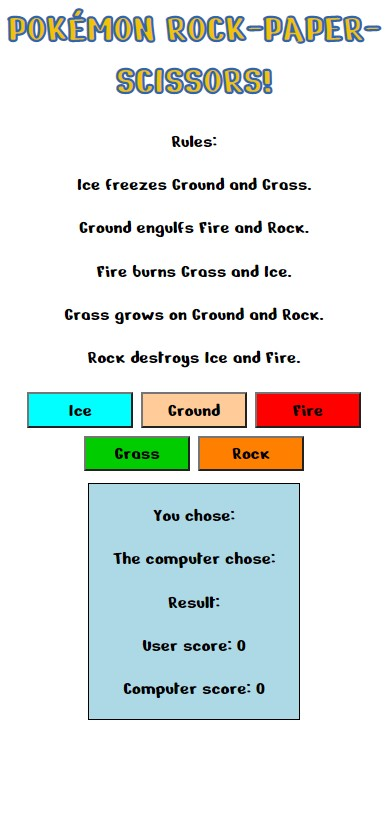
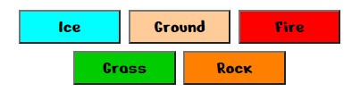

# Pokémon Rock - Paper - Scissors!

This website is made to display and run the traditional childhood game of rock-paper-scissors but with a fun twist. Based on the famous 'Rock-Paper-Scissors-Lizard-Spock game from the popular TV series The Big Bang Theory, my game is using the type match ups from the world wide famouse franchise of Pokémon. There are five different options for the users to choose from, and although there are many more Pokémon types eacvh of these five have two weaknesses and two strengths. This makes it an equal chance of winning or loosing no matter what you pick, just like in regular rock-paper-scissors. The goal with this website was to make a fun looking game that is also fairly simple so it is easy for children use. They are able to play against the computer and see the scores clearly. As well as being a childrens game, the website could also be considered educational in helping children to learn the type match ups as this would be very helpful when playing the Pokémon card or video games.

### Link to deployed site:

[Photo taken using amiresponsive.com](https://ui.dev/amiresponsive)

---

## User Expectations / Stories

- As a user I would like to be able to play a simple game against the computer
- As a user I would like the website to be child friendly and easy to use
- As a user I should be able to see clear instructions/rules for the game
- As a user I need to be able to see my score and the computers score

---

## Target Audience
- The target audience for this website is definitely children at around 5 - 12 years old. It is at this young age that most people are introduced to rock-paper-scissors, usually in primary school. However this game is a little more complex with it having five options rather than 3, hence why I would argue that chldren up to 12 years old would find it interesting. Especially if they are into Pokémon, which is aimed at children of this age group too and is still widely popular today.
-  To cater to ages 5 -12 years the site needs to be easy to read and navigate with the help of clear, simple text and bold colours. Use of images will help to explain the rules better than lots of written instructions.

---

## Existing Features:

### *Design Features:*

- **Color Scheme:** I wanted the colour scheme to be bright ans playful to appeal to children. It is also based around the colours often used in the Pokémon franchise itself to clearly show what the game is about. I used the a blue outline with yellow text for the header, taking inspiration from the classic blue and yellow Pokémon logo. Of course due to copyright I could not use their actual logo in my work. The colours of the buttons match the corresponding ones on the diagram and are based off of what colours are commonly used for each type in the Pokémon games, for example red for fire, light blue for ice and so on. This will help anyone who has played the video games to remember the types and noy get confused by the colours chosen. I kept the background white and used black text for two reasons: this is how text oftent appears in the video games, and it is easy to read for young children whilst contrasting nicely from the brightly coloured buttons and diagram.

- **Font:** I used a font called 'Nerko One' which I found on Google Fonts. I chose it because it has a fun yet simplistic look to suit my young target audience. It's not too complicated but also suits the playful Pokémon theme very well as it's quite bold and curvy. I decided to stick with this font for the entire site (except in the diagram image as I couldn't use it there) as it worked do well and gave the site a complete, clean look. Multiple fonts on a website with not so much content coould look messy and be harder for young children to read. At first I was annoyed that I could'nt add the same font into the diagram, but then I realised this was probably better. It having a different font from the buttons shows that it is not interactable, but a separate image that cannot be clicked on. Helvetica is the name of the font used in the diagram and I chose it because it's a little thinner which gives it a simple and clean look. Again it's very easy to read, which is essential for the diagram to convey information effectively.

### *Structural Features:*

- **The Header:** In the header I simply used a h1 element to write the title of my page. I didn't want it to be too long as that would be confusing and not very eye-catching. So I went with 'Pokémon Rock-Paper-Scissors' instead of something like 'Ice-Ground-Fire-Grass-Rock', which would be an obvious name for it since the game itself is based on Rock-Paper-Scissors-Lizard-Spock. However this is a little too long and hard to remember to appeal for my target audience. Referencing both Pokémon and rock-paper-scissors in the header immediatly tells the user what the game is about.

- **The Diagram:** The diagram I created myself and saved as an image to use on my website. It sits in the center of the page and is quite large as it need to be easy to see the writting and arrow directions. The image itself sits inside a div element, allowing me to apply flex styling to them in the CSS file. This ensures that the image stays in the center and is responsive to the screen size.

- **The Choice Area:** This is the name given to a class which is applied to the div containing my buttons. It is the area of the page where the user can choose their option out of the five given types. The buttons match the exact same hex colour as their corresponding rectangle on the diagram to clearly link them. This helps the user see what choice is effective aginst/ weak against what. They also have a hover rule applied in the CSS so that they turn black with white text when hovered over. This is also where the JavaScript comes in. An event listener is applied to the buttons. When a buttons is clicked, its name or 'data-type' is set as the user's choice. A function is then called to make the computer pick a random answer out of the same five options. THis is set as the computers choice. The users and computers choices are then compared in another function. The result is then displayed in the next section of the page.

- **The Result Area:** The result area consists of three paragraphs each with a span for an answer to be put into. The colours here are black text on a white background, keeping with the flow of the page. The users choice is diplayed using JavaScript, so the user can check what they picked, as is the computers random answer. If the function comparing the two choices finds that they are the same, it will siplay the message: "The computer chose the same answer, it's a draw!". If it finds that the users choice beats the computers choice, it will display: "You win!". If the computer beats the user it will display: "You loose!". This helps the user understand what is happening. It is of course important that they know if they won or not.

- **The Score Area:** As the name might suggest the scores are displayed here. Appon determining if the user won, lost or drew a function is called in JavaScript which changes the score acordingly. If it finds that the result was "The computer chose the same answer, it's a draw!" it will do nothing. No points will be awarded. If the answer was "You win!" it will increase the users score by 1. Likewise if the result was "You loose!" it will increase the computers score by 1. The two different scores are written on separate lines to help prevent the user confusing the two.

- **The Footer:** The footer for this website is very simple, containing only the written rules of the game. I tried to keep the explanation as short and easy to understand as possible. 

## Future Features: 

- **Other Game Designs:** I would love to make the game a little more interesting by having it be based on actual knowledge rather than complete chance. For example having the computer display a random image of a Pokémon and the user then has to guess what type it is. If the user is correct they get a point, if not the computer gets a point.

- **Multiple Game Modes:** Having multiple game modes to choose from would also be a very cool feature to add to this website. For example a similar game using just water-fire-grass. It could be considered an 'easy mode' as it has less rules and is easier to understand.

- **Icons:** I considered using icons of the five elements in the buttons next to the written names. The problem with this is that it's very hard to find good, clear icons to differenciate between ground and rock. If I could source or make some good ones they might add a nice touch to the page and aid the user in the game. Especiallly for younger aged players who don't yet have good reading skills.

---

## Technologies:

- This site was created using three programming languages: HTML, CSS and JavaScript.
- [Github](https://github.com/) and [Gitpod](https://www.gitpod.io/) were used to create my repository and for writting the code.
- [Diagrams.net](https://app.diagrams.net/) is the website I used to create my diagram and save it as an image for use on my website.
- [Image Color Picker](https://imagecolorpicker.com/en) is the website which I used for selecting the hex colour code from my diagram to use on the corresponding buttons.
- [Google Fonts](https://developers.google.com/fonts) is where I sourced my font from.
- [Am I Responsive.com](https://ui.dev/amiresponsive) is the website I used to show my finished site on different devices at the top of this page.

---

## Testing:

### Supported Screens and Browsers:

- The site was viewed and tested on the Google Chrome browser.
- Differnt screen sizes were tested using the simulator that is part of Chrome's dev tools.
- As a result all screenshots of different screen sizes are also taken from this simulator on Google Chrome.
- Tested/ supported devices: Galaxy Fold, Moto G4, iPhone 4, 6, 7, 8, X, XR and 12 Pro, Pixel 5, Samsung Galaxy S8+, S20 Ultra and A51/71, iPad, iPad Air, Mini and Pro, Surface Pro 7, Surface Duo, Nest Hub and Nest Hub Max.

### Test Cases:

- **Main Page:** Upon opening the website the user will see the main and only page, starting with heading in the center. As you can see everything on the page is responsive to the screen size. All the text, the buttons and the image reduce in size as the screen size gets smaller thanks to the use of media queries and flexbox in the CSS file.

Desktop size example:

Tablet size example:

Phone size example:

- **The Diagram Image:** When testing out different images for my site, I found that there aren't many images currently available of this diagram specifically. The best one I could find was this one below, but I didn't think it was good enough to use in my site. It isn't very clear, the quality of image isn't great and the colours don't stand out.

- So I decided to make my own diagram using a website called [Diagrams.net](https://app.diagrams.net/). Using the squared background to help align, I began making my diagram with the same basic structure as the first image. It shows how the different types effect each other really clearly.

 

- Then I added the bright colours and black text to fit my colour scheme. One feature which is really useful about this website is that you can use hex code to choose colours for your diagram. This allowed me to pick colours that fit well with my colour scheme and use the exact same colours elsewhere on my site.

- The finished product looked much better than other images I could've sourced online.

- **The Choice Area:** This is the area that contains the buttons. The user will see that the buttons will wrap to the line below when the screen size gets too small for them to fit clearly on one line. (At 414px width or below.)

- They also have a hover pseudo class. The user should see that they change to a black background with white text when hovered over.

- **The Result Area:** Impotantly both the choices and the scores are blank and set to 0 when the user first opens the page. The user can also click on the heading to refresh the page at any time to reset them.

- **Game Testing:** When the user clicks on a button, its 'data-type' or the text within the button should show up after 'You chose:' to show the user what they chose. The computers random choice will then be visible to the user after the 'Computer chose:' text. The text following 'Result:' will also change depending on the outcome, so that the user can see it, and the score will then change acordingly for the user to see.

Example of a user loosing:

Example of a user winning:

Example of a draw:

Example of the score increasing as the game is played more:

- **The Footer:** The user should see that the footer text will fit onto more lines at a smaller screen size to become more easily readable.

Desktop size:

Tablet size:

Phone size:

## Validator Testing:

- I used the [W3C HTML Validator](https://validator.w3.org/#validate_by_input) to test my html. The results showed 0 errors.

- I used the [W3C CSS Validator](https://jigsaw.w3.org/css-validator/#validate_by_input) to test my CSS and there were 0 errors.

- I have tested my JavaScript using [JSHint](https://jshint.com/) and there are some warnings but no errors. The variable 'result' that is undefined is on purpose, so that it resets every time the page is refreshed or opened.

- I have tested my site using the devtools Lighthouse feature. The score is very good with a minimum of 90% in each field.

---

## Bugs:

- Luckily I didn't come across any bugs whilst making this website. I think this is because it is relatively simple and there isn't much content to discover bugs within. The JavaScript was very difficult for me, and at times I wasn't sure why my code didn't work. However it was simply lack of knowledge on my part causing this, not any actual bugs.

## Deployment:

### Gitpod

- Typing 'python3 -m http.server' into the Gitpod terminal and clicking open browser on the pop up window allows you to view the site in a browser as if it were live.
- Every time a secton of code is added the browser can be refreshed to see the change. Sometimes you need to press ctrl, shift and R at the same time for changes to be updated.
- To save your progress, type 'git add .' into the terminal to add all your changes, followed by 'git commit -m' and then your message describing what you did in double quotes.
- Lastly type'git push' and this will push your code along with all the saved changes. This should be done at the end of every coding session or whenever you want an already deployed site to be updated.

### Github and Github Pages

- To deploy my site I first went to Github and found my project repository on the left hand side and clicked it.
- I then clicked on 'Settings' and then the 'Pages' option on the left.   
- Here I changed the branch from 'none' to 'main'.
- Finally I clicked save and after a short while it produced a link to my deployed site.
- I made sure to click on the link to check that it worked.

**Link to deployed site:**
INSERT HERE

---

## Credits: