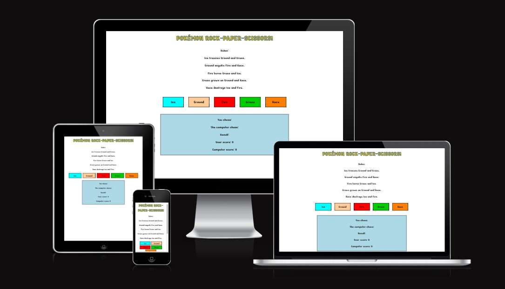
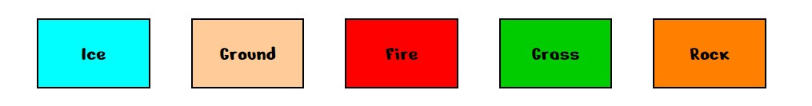
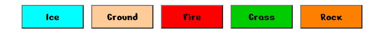
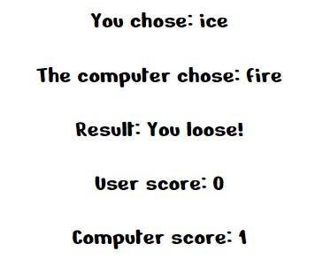
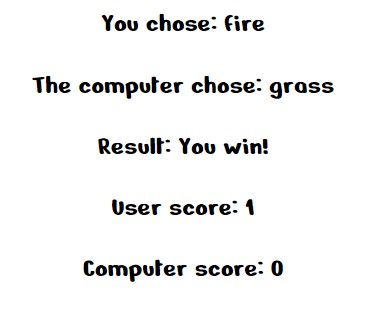
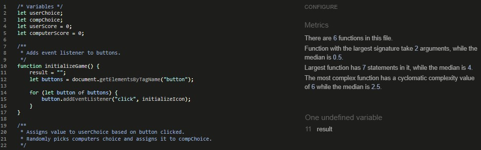

# Elemental Match-Up!

This website is made to display and run a simple game of 'rock-paper-scissors' but with a fun twist. Based on the famous 'Rock-Paper-Scissors-Lizard-Spock' game from the popular TV series The Big Bang Theory, my game is using the type match ups from the world wide famouse franchise of Pokémon. There are five different options for the users to choose from, and although there are many more Pokémon types each of these five have two weaknesses and two strengths. This makes it an equal chance of winning or loosing no matter what you pick, just like in regular rock-paper-scissors. The goal with this website was to make a fun looking game that is also fairly simple so it is easy for children play. They are able to play against the computer and see the scores clearly. The game helps children to have fun whilst also learning the type match ups, which would come in handy when playing the Pokémon card or video games too.

### Link to deployed site: https://madeleinewalder.github.io/Elemental-match-up/

[Photo taken using amiresponsive.com](https://ui.dev/amiresponsive)

---

## User Expectations / Stories

- As a user I would like to be able to play a simple game against the computer
- As a user I should be able to see clear instructions/rules for the game
- As a user I will need to know if I won, lost or drew the game each time
- As a user I need to be able to see my score and the computers score

---

## Target Audience:

- The target audience for this website is definitely children at around 5 - 12 years old. It is at this young age that most people are introduced to rock-paper-scissors, usually in primary school. However this game is a little more complex with it having five options rather than 3, hence why I would argue that chldren up to 12 years old would find it interesting. Especially if they like Pokémon which is aimed at children of this age group too and is still widely popular today.

-  To cater to ages 5 -12 years the site needs to be easy to read and navigate with the help of clear, simple text and bold colours. 

---

## Existing Features:

### *Design Features:*

- **Color Scheme:** I wanted the colour scheme to be bright and playful to appeal to children. It is also based around the colours often used in the Pokémon franchise itself to clearly show what the game is about. I used the a blue outline with yellow text for the header, taking inspiration from the classic blue and yellow Pokémon logo. Of course due to copyright I could not use their actual logo in my work. The colours of the buttons are based off of what colours are commonly used for each type in the Pokémon games, for example red for fire, light blue for ice and so on. This will help anyone who has played the video games to remember the types and noy get confused by the colours chosen. I kept the background white and used black text for two reasons: this is how text oftent appears in the video games, and it is easy to read for young children whilst contrasting nicely from the brightly coloured buttons.

- **Font:** I used a font called 'Nerko One' which I found on Google Fonts. I chose it because it has a fun yet simplistic look to suit my young target audience. It's not too complicated but also suits the playful Pokémon theme very well as it's quite bold and curvy. I decided to stick with this font for the entire site as it worked do well and gave the site a complete, clean look. Multiple fonts on a website with not so much content could look messy and be harder for young children to read. 

### *Structural Features:*

- **The Header:** In the header I simply used a h1 element to write the title of my page. I didn't want it to be too long as that would be confusing and not very eye-catching. So I went with 'Pokémon Rock-Paper-Scissors' instead of something like 'Ice-Ground-Fire-Grass-Rock', which would be an obvious name for it since the game itself is based on Rock-Paper-Scissors-Lizard-Spock. However this is a little too long and hard to remember for my young target audience. Referencing both Pokémon and rock-paper-scissors in the header immediatly tells the user what the game is about.

- **The Rules:** This area contains the rules of the game written clearly in black on the white background. This way the user can see them easy and reference them when needed.

- **The Choice Area:** This area contains the clickable buttons. It is the area of the page where the user can choose their option out of the five given types. The buttons have a hover rule applied in the CSS so that they turn black with white text when hovered over. 

- **The Result Area:** The result area is where the users choice, computers random choice, result and scores are shown to the user. The colours here are black text on a white background, keeping with the flow of the page. It is of course important that the user can see all of this information, especially if they won or lost.

## Future Features: 

- **Other Game Designs:** I would love to make the game a little more interesting by having it be based on actual knowledge rather than complete chance. For example having the computer display a random image of a Pokémon and the user then has to guess what type it is. If the user is correct they get a point, if not the computer gets a point.

- **Multiple Game Modes:** Having multiple game modes to choose from would also be a very cool feature to add to this website. For example a similar game using just 'water-fire-grass'. It could be considered an 'easy mode' as it has less rules and is easier to understand.

- **Icons:** I considered using icons of the five elements in the buttons next to the written names. The problem with this is that it's very hard to find good, clear icons to differenciate between ground and rock. If I could source or make some good ones they might add a nice touch to the page and aid the user in the game. Especiallly for younger players who don't yet have good reading skills.

---

## Technologies:

- This site was created using three programming languages: HTML, CSS and JavaScript.
- [Github](https://github.com/) and [Gitpod](https://www.gitpod.io/) were used to create my repository and for writting the code.
- [Diagrams.net](https://app.diagrams.net/) is the website I used to create my diagram and save it as an image for use on my website.
- [Image Color Picker](https://imagecolorpicker.com/en) is the website which I used for selecting the hex colour code from my diagram to use on the corresponding buttons.
- [Google Fonts](https://developers.google.com/fonts) is where I sourced my font from.
- [Am I Responsive](https://ui.dev/amiresponsive) is the website I used to show my finished site on different devices at the top of this page.

---

## The Game: 

### I made the game for this website using JavaScript, and basic steps are as follows: 

- First I added an event listener for when the page content loads to begin the game. 

- This triggers another event listener, which listens for the user to click one of the five buttons. When the user clicks a button, the value is assigned to a variable called 'userChoice'. This is displayed to the user so they can see what button they clicked. 

- The computer then chooses a random number from 0-4. Each number corresponds to one of the five values, which are the same as the five buttons the user can click. This value is assigned to a variable called 'compChoice', and its content displayed to the user so they can see what the computer picked.

- The two variables 'userChoice' and 'compChoice' are then compared. If they are the same it's a draw, and the result string "The computer chose the same answer, it's a draw!" is returned. 

- If the userChoice meets the win conditions for the option chosen, the result string "You win!" is returned. For example if the userChoice was 'fire', the win conditions would be 'grass' and 'ice' because fire beats those. So if the compChoice was either 'grass' or 'ice' then the win conditions would be met.
'
- However if userChoice does not meet the win conditions, and the two variables are not the same then the user must have lost, it's the only other option. Therefore the result string "You loose!" is returned. 

- This result string is then displayed to the user so that they can see if they won, lost or drew. 

- If the result string is "You win!" the users score will be increased by one. Likewise if it's "You loose!" the computers score will be increased by one. Of course in the case of a draw nothing needs to happen as no points are awarded.

---

## Testing:

### Supported Screens and Browsers:

- The site was viewed and tested on the Google Chrome browser.
- Differnt screen sizes were tested using the simulator that is part of Chrome's dev tools.
- As a result all screenshots of different screen sizes are also taken from this simulator on Google Chrome.
- Tested/ supported devices: Galaxy Fold, Moto G4, iPhone 4, 6, 7, 8, X, XR and 12 Pro, Pixel 5, Samsung Galaxy S8+, S20 Ultra and A51/71, iPad, iPad Air, Mini and Pro, Surface Pro 7, Surface Duo, Nest Hub and Nest Hub Max.

### Test Cases:

- **Main Page:** Upon opening the website the user will see the main and only page. Everything on the page is responsive to the screen size and all the content is centered.

Desktop size example:

Tablet size example:

Phone size example:

- **The Header:** The header is responsive to the screen size and fits on to more than one line where needed.

Desktop size example:

Tablet size example:

Phone size example:

- **The Rules:** The user should be able to see the game rules written here for them to follow.

Desktop size example:

Tablet size example:

Phone size example:

- **The Choice Area:** This is the area that contains the buttons. The user will see that the buttons will wrap to the line below when the screen size gets too small for them to fit clearly on one line. (At 686px width or below.)

Desktop size example:

Tablet size example:

Phone size example:

- They also have a hover pseudo class. The user should see that they change to a black background with white text when hovered over.

- **The Result Area:** The user will be able to see the results of the game here. The box is responsive to the screen size.

Desktop size example:

Tablet size example:

Phone size example:

- Impotantly both the choices and the scores are blank and set to 0 when the user first opens the page. The user can also click on the heading to refresh the page which will reset them.

- **Game Testing:** Before styling this area I tested every single outcome of the game to make sure it worked as expected. I did this by clicking on each button until I got each possible outcome, and checking they were correct. I also made sure that the score was going up appropriately. Here are a few test examples:

The user picks ice and computer picks fire. The user looses, the computer gains a point.

The user picked fire and the computer picked grass. The user wins, they gain a point.

Both picked rock, so it's a draw. No points are awarded.

Example of the score increasing as the game is played multiple times:

## Validator Testing:

- I used the [W3C HTML Validator](https://validator.w3.org/#validate_by_input) to test my html. The results showed 0 errors.

- I used the [W3C CSS Validator](https://jigsaw.w3.org/css-validator/#validate_by_input) to test my CSS and there were 0 errors.

- I have tested my JavaScript using [JSHint](https://jshint.com/) and there is no errors. The variable 'result' that is undefined is on purpose, so that it resets to blank every time the page is refreshed or opened.

- I have tested my site using the devtools Lighthouse feature. The score is very good with a minimum of 94% in each field.

---

## Bugs:

- Luckily I didn't come across any bugs whilst making this website. I think this is because it is relatively simple and there isn't much content to discover bugs within.

## Deployment:

### Gitpod

- Typing 'python3 -m http.server' into the Gitpod terminal and clicking open browser on the pop up window allows you to view the site in a browser as if it were live.
- Every time a secton of code is added the browser can be refreshed to see the change. Sometimes you need to press ctrl, shift and R at the same time for changes to be updated.
- To save your progress, type 'git add .' into the terminal to add all your changes, followed by 'git commit -m' and then your message describing what you did in double quotes.
- Lastly type'git push' and this will push your code along with all the saved changes. This should be done at the end of every coding session or whenever you want an already deployed site to be updated.

### Github and Github Pages

- To deploy my site I first went to Github and found my project repository on the left hand side and clicked it.
- I then clicked on 'Settings' and then the 'Pages' option on the left.   
- Here I changed the branch from 'none' to 'main'.
- Finally I clicked save and after a short while a link to my deployed site is displayed on screen.
- It can take a few minutes, but if nothing happens I find that typing anything in the 'Custom domain' input box and pressing enter can cause the page to produce the link.
- I made sure to click on the link to check that it worked.

**Link to deployed site:**
https://madeleinewalder.github.io/Elemental-match-up/

---

## Credits:

- I would like to credit a website called [codesdope.com](https://www.codesdope.com/blog/article/adding-outline-to-text-using-css/) as I used a line of code displayed on their website in my CSS file on line 40. The syntax I used was ' -webkit-text-stroke: ' and I followed it with my own code of ' 1px #2e67b0; ' to add the blue outline to my header text. 